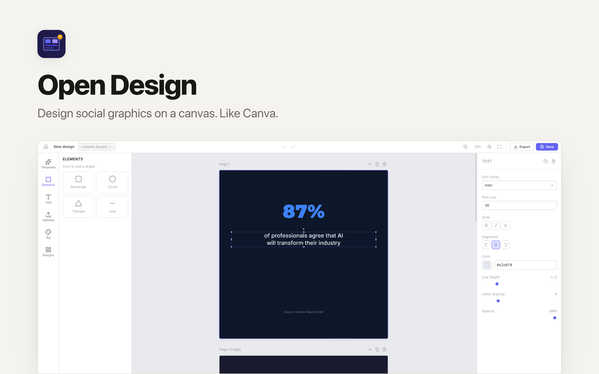

# OpenDesign: The Open-Source Canva Alternative for SaaS

[](https://app.clawnify.com/deploy?repo=clawnify/OpenDesign)

A design editor for creating professional social media graphics — LinkedIn posts, quote cards, announcements, and more. Part of the [OpenClaw](https://github.com/openclaw/openclaw) ecosystem. Zero cloud dependencies — runs locally with SQLite.

Built with **Preact + Fabric.js + Tailwind CSS + Hono + SQLite**. Ships with a Figma-inspired dark editor UI, retina canvas rendering, and pre-built LinkedIn post templates.

## What Is It?

OpenDesign is a production-ready graphic design editor designed for the OpenClaw community. Think of it as an open-source Canva alternative — a visual design tool you can self-host, customize, and embed in any SaaS product.

Unlike Canva or Adobe Express, this runs entirely on your own infrastructure. No subscriptions, no watermarks, no vendor lock-in. Create pixel-perfect social media graphics with professional typography and export at 2x resolution.

## Features

- **Fabric.js canvas** — full object manipulation with retina/HiDPI rendering (2x device pixel ratio)
- **Pre-built templates** — LinkedIn-optimized: Quote Card, Stats Highlight, Announcement, Tips List, Profile Card, Minimal Text
- **10 Google Fonts** — Inter, Playfair Display, Montserrat, Poppins, Roboto, Open Sans, Lora, Raleway, Source Sans Pro, Merriweather
- **Text editing** — font family, size, weight, alignment, color, line height, letter spacing
- **Shapes** — rectangles, circles, triangles, lines with fill, stroke, border radius
- **Image uploads** — drag-and-drop or click to upload, place on canvas
- **Backgrounds** — solid colors, gradients, uploaded images
- **Canvas sizes** — LinkedIn Square (1080x1080), LinkedIn Landscape (1200x627), LinkedIn Portrait (1200x1500), Instagram Story (1080x1920)
- **Undo/Redo** — full history with keyboard shortcuts (Cmd+Z / Cmd+Shift+Z)
- **2x PNG export** — crisp high-resolution output for social media
- **Auto-save** — designs persist to SQLite with debounced saves
- **Dual-mode UI** — human-optimized + AI-agent-optimized (`?agent=true`)

## Quickstart

```bash
git clone https://github.com/clawnify/OpenDesign.git
cd open-design
pnpm install
pnpm run dev
```

Open `http://localhost:5178` in your browser. Data persists in `data.db`, uploads in `uploads/`.

### Agent Mode (for OpenClaw / Claude Code)

Append `?agent=true` to the URL:

```
http://localhost:5178/?agent=true
```

This activates an agent-friendly UI with:
- Explicit buttons always visible (no hover-to-reveal)
- Large click targets for reliable browser automation
- All controls accessible without drag interactions
- Semantic labels for AI navigation

### Using with Claude Code

Claude Code can interact with the design editor through the REST API:

```bash
# Create a new design
curl -X POST http://localhost:3006/api/designs \
  -H "Content-Type: application/json" \
  -d '{"name": "Q1 Results", "width": 1080, "height": 1080}'

# Load a template
curl http://localhost:3006/api/templates/1

# Update design with canvas JSON
curl -X PUT http://localhost:3006/api/designs/1 \
  -H "Content-Type: application/json" \
  -d '{"canvas_json": "{...}"}'
```

OpenClaw agents can also use the browser tool to visually interact with the editor — navigate, click templates, edit text, and export PNGs.

## Tech Stack

| Layer | Technology |
|-------|-----------|
| **Frontend** | Preact, TypeScript, Tailwind CSS v4, Vite |
| **Canvas** | Fabric.js v6 (retina rendering, object manipulation) |
| **Backend** | Hono, Node.js |
| **Database** | SQLite (better-sqlite3) |
| **Fonts** | Google Fonts (WebFontLoader) |
| **Icons** | Lucide |

### Prerequisites

- Node.js 20+
- pnpm (or npm/yarn)

## Architecture

```
schema.sql      — SQLite schema (designs, templates, pages)
demo/seed.sql   — Sample designs for the Clawnify demo workspace
src/
  server/
    db.ts       — SQLite wrapper (query, get, run, transaction)
    index.ts    — Hono REST API (designs CRUD, templates, uploads)
    uploads.ts  — Image uploads in the app's R2 bucket
    dev.ts      — Dev server with static file serving
  client/
    app.tsx           — Root component
    fonts.ts          — Bundled canvas fonts
    context.tsx       — Editor context + canvas size presets
    hooks/
      use-canvas.ts   — Fabric.js state, undo/redo, zoom, export
      use-designs.ts  — Designs CRUD + auto-save + template loading
    components/
      editor.tsx        — Main layout (toolbar + sidebars + canvas)
      canvas.tsx        — Fabric.js canvas with retina rendering
      toolbar.tsx       — Size picker, undo/redo, zoom, export, save
      left-sidebar.tsx  — Templates, text, shapes, images, backgrounds
      right-sidebar.tsx — Properties panel (context-aware per selection)
      template-card.tsx — Template thumbnail in gallery
      design-list.tsx   — Saved designs list with rename/delete
```

### Data Model

```sql
designs   (id, name, canvas_json, width, height, thumbnail_url, created_at, updated_at)
templates (id, name, category, canvas_json, width, height, thumbnail_url, sort_order)
```

### API Endpoints

| Method | Endpoint | Description |
|--------|----------|-------------|
| GET | `/api/designs` | List all designs |
| POST | `/api/designs` | Create a design |
| GET | `/api/designs/:id` | Get a design |
| PUT | `/api/designs/:id` | Update a design |
| DELETE | `/api/designs/:id` | Delete a design |
| GET | `/api/templates` | List all templates |
| GET | `/api/templates/:id` | Get a template |
| POST | `/api/uploads` | Upload an image file |
| GET | `/api/uploads/:filename` | Serve an uploaded image |

## Community & Contributions

This project is part of the [OpenClaw](https://github.com/openclaw/openclaw) ecosystem. Contributions are welcome — open an issue or submit a PR.

## License

MIT
