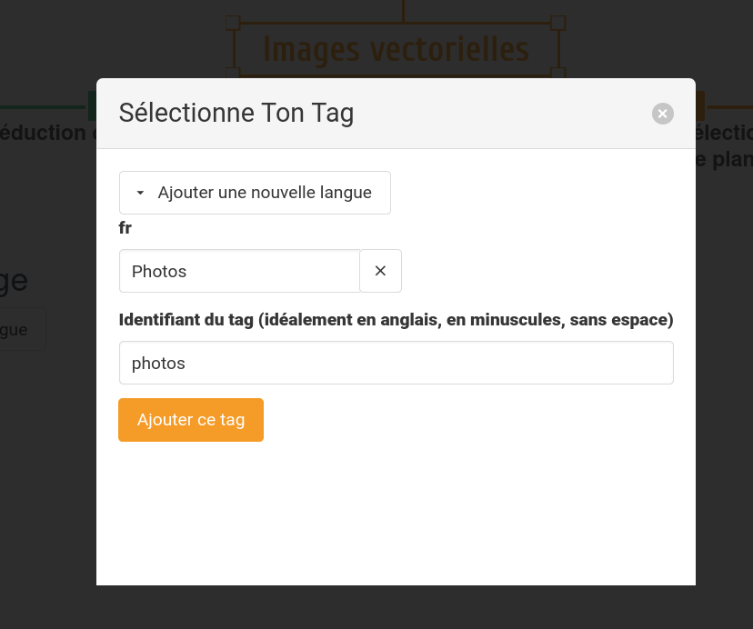

Les couleurs, images et modèles peuvent être **catégorisés** avec un système de **tags**.

Il est actuellement possible de créer des tags via Backtivisda et de les assigner aux images nouvellement uploadées. Les modifications sont à réaliser directement dans le projet Gitlab.

## Créer une nouvelle catégorie

Pour créer une nouvelle catégorie, il faut démarrer le chargement d'une image puis, dans la section « Titre et tags » cliquer sur le bouton « Ajouter une catégorie ».

Le tag est alors accessible et peut être utilisé pour les images, images de fonds ou modèles.

## Modifier une catégorie

Pour changer la traduction d’une catégorie, il est actuellement nécessaire d’aller modifier le fichier `tags.json` directement dans le projet Gitlab. De même pour insérer la catégorie sur des images déjà existantes.